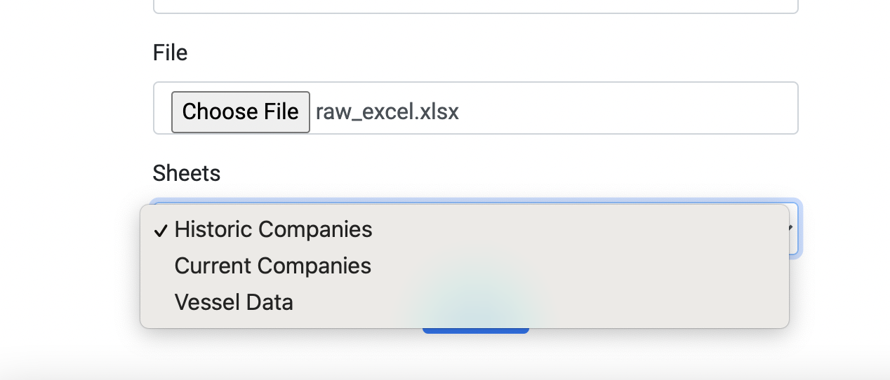

# Acceptable data formats

Dojo can accept `CSV`, `Excel`, `GeoTIFF` and `NetCDF` files. When you initially upload a file you may be presented with a set of options depending upon the detected file type.

> To make this process as efficient as possible, we recommend removing any extraneous columns (if your data is in CSV or Excel file) before uploading it to Dojo.

Excel files require that you select a worksheet. If your file is large, please wait until you see the detected worksheet names and select the appropriate one. If your data is columnar (CSV or Excel) it must have one column per item of interest. For example, a table that looks like this would be acceptable:

| Year | Country  | Crop Index |
|------|----------|------------|
| 2015 | Djibouti | 0.7        |
| 2016 | Djibouti | 0.8        |
| 2017 | Djibouti | 0.9        |

However, a transposed dataset such as the following would be unacceptable:

| Country  | 2015 | 2016 | 2017 |
|----------|------|------|------|
| Djibouti | 0.7  | 0.8  | 0.9  |
| Eritrea  | 0.6  | 0.7  | 0.9  |

A dataset such as the above should be transformed by the user _beforehand_ so that each item of interest has its own column. 

If your `CSV` or `Excel` file has extraneous rows or columns, includes arbitrary linebreaks (e.g. for human readability) or is otherwise malformed it should be cleaned up in Excel before registering it to Dojo.

Data preparation for Dojo is less an issue for other acceptable formats. If your dataset is a `GeoTIFF`, you will be asked to provide the data band you wish to process and the name of the feature that resides in that band. You may optionally provide a date for the respective band.

Below is an image of the form that should appear after a multisheet excel file has been uploaded
