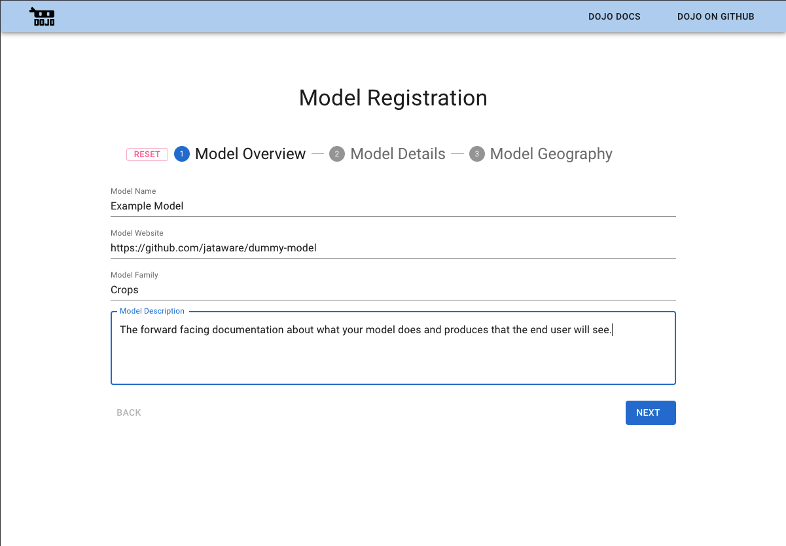
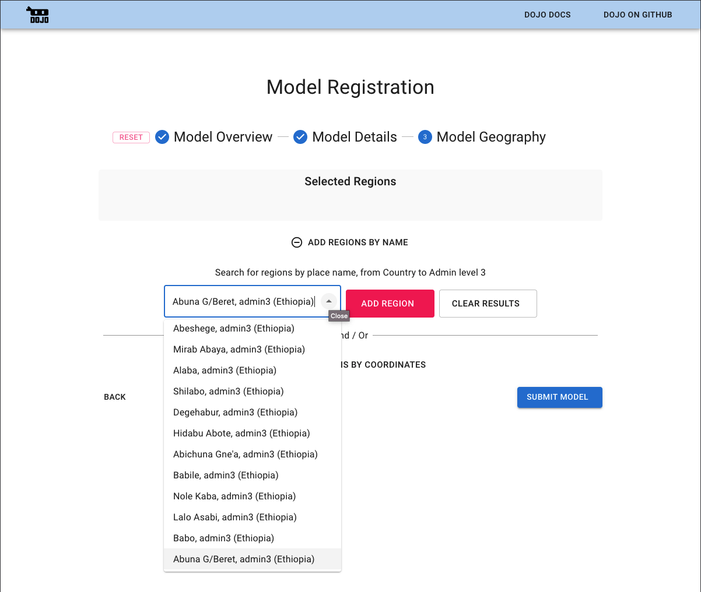
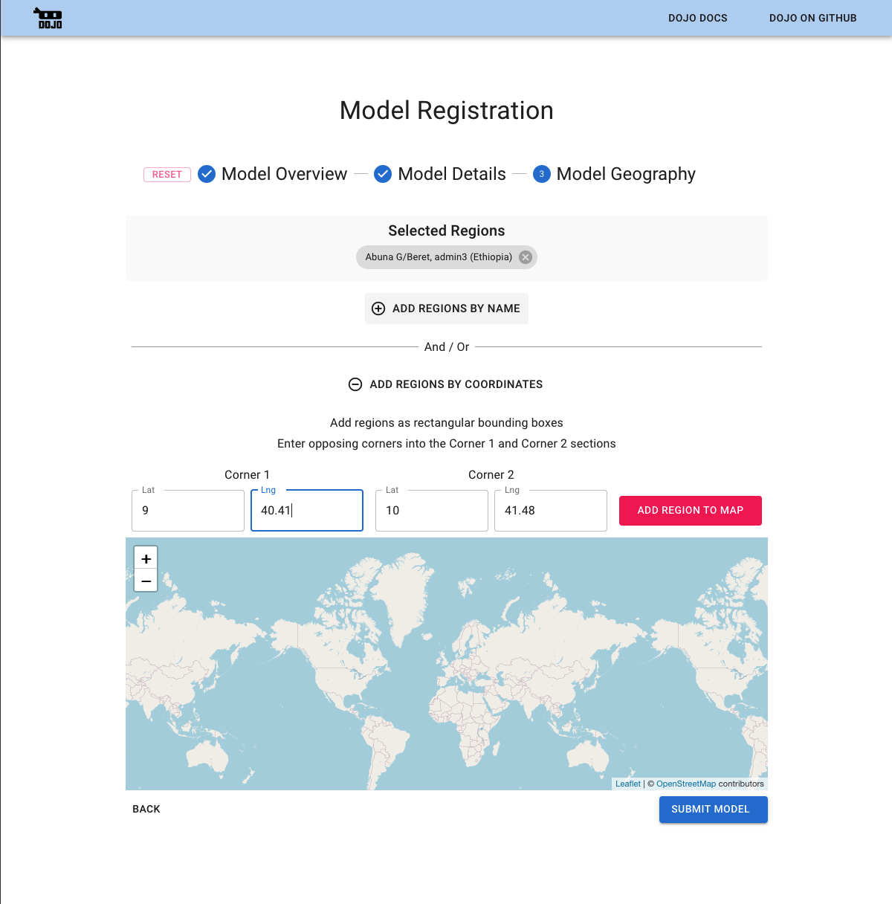
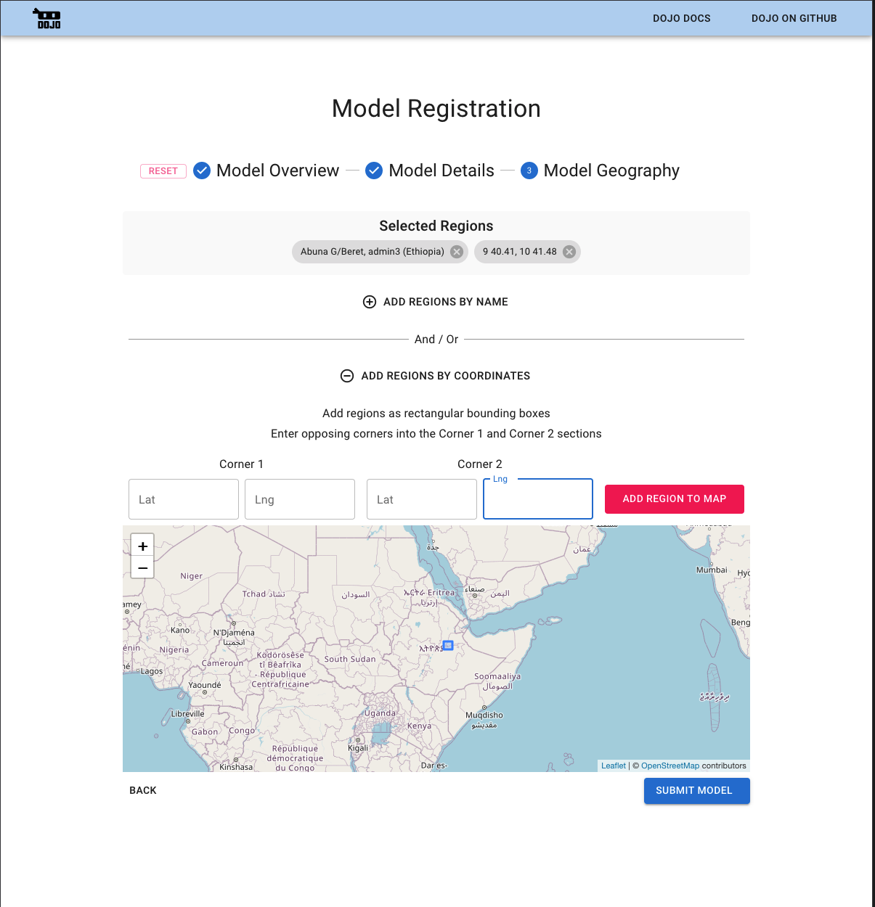
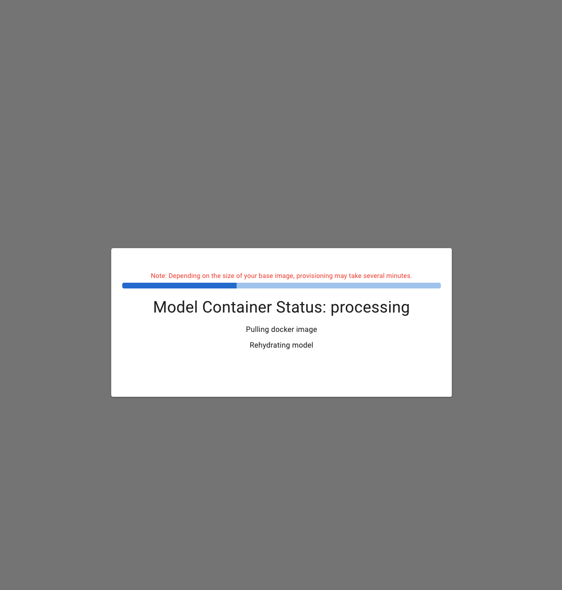
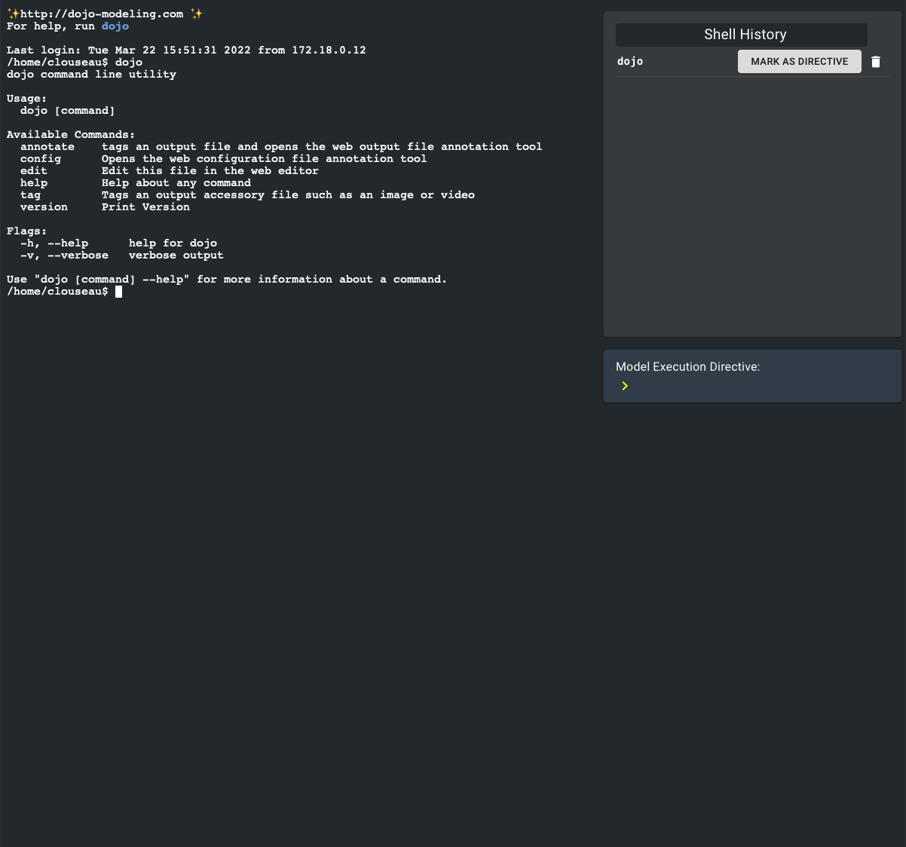
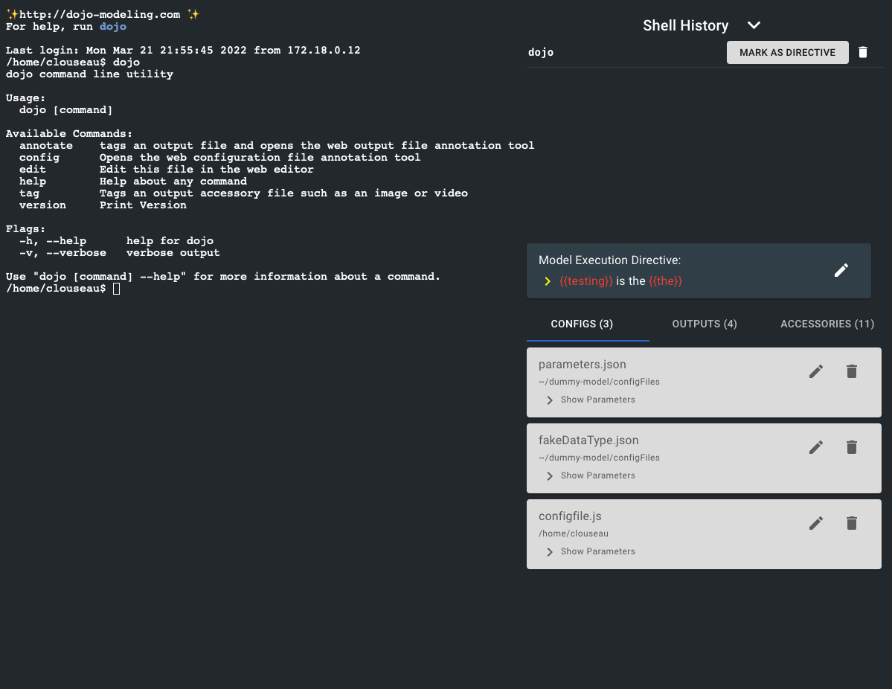
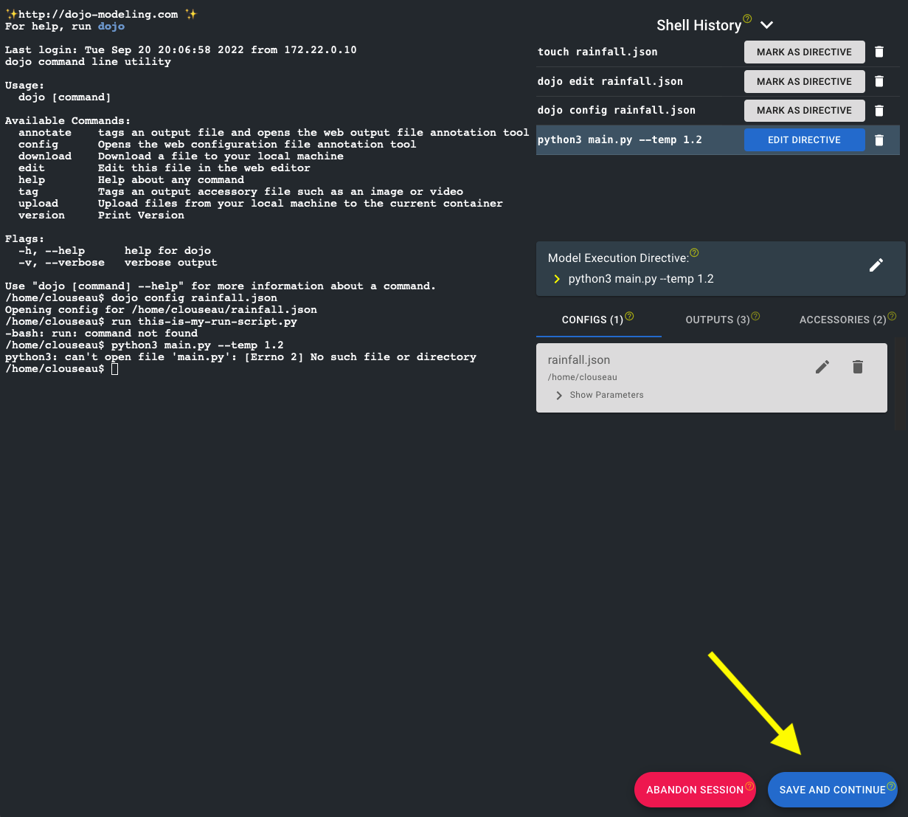
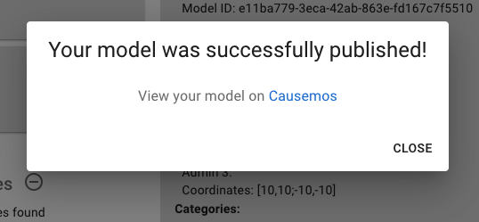

<style>
  .iframe-container {
		text-align:center;
  		width:100%;
  }
</style>

# Model Registration

## Contents

- [Overview](#overview)
- [Model Metadata and Provenance](#model-metadata-and-provenance)
- [Containerization and Execution](#containerization-and-execution)
  - [Building your model](#building-your-model)
  - [Dojo Commands](#dojo-commands)
  - [Configuration File Annotation](#configuration-file-annotation)
  - [Directive Annotation](#directive-annotation)
  - [Editing or Deleting Files](#editing-or-deleting-existing-dojo-files)
  - [Output File Annotation](#output-file-annotation)
  - [Completing the Registration](#completing-the-registration)
  - [Summary Page and Publishing](#summary-page-and-publishing)


## Overview
There are two main activities associated with registering a model to Dojo:

1. **Model Metadata and Provenance**: modelers begin the registration process by providing key metadata about their model and choosing relevant geographic regions so that Dojo can facilitate search and discovery across its model registry.

2. **Containerization and Execution**: next, modelers are directed to a containerization environment. Here, modelers teach Dojo how to run their models and how to set parameters. They can also provide metadata about model output files. The end result is the publication of a Docker image and associated metadata about the registered model.

To get started, visit [https://dojo-modeling.com](https://dojo-modeling.com/). Please reach out to [dojo@jataware.com](mailto:dojo@jataware.com) for credentials or help with the application. 

## Model Metadata and Provenance

To begin the process, Dojo captures metadata about each model and its maintainer. It's important to be as thorough as possible to ensure that the end-user can understand at a high-level what each model does, how it does it, and what it produces.



Key definitions:

- `Model Name`: (required) The end-user will see this name when running your model. While spaces and upper/lower case are allowed, _**do not use special characters, including parentheses**_.
- `Model Website`: (required) This can be a link to your model repository or another website that provides additional context about your model.
- `Model Family`: (required) Model family refers to a group of models with similar characteristics. If you have several procedures based on the same underlying model family, you can link those models or model procedures here under a common family name of your choosing, such as `LPJmL`. If your model does not have a natural grouping with other models, you can name it with an appropriate category related to your model or repeat your model name.
- `Model Description`: (required) This is the forward-facing documentation about your model that the end-user will see. Include as much information as possible to explain what your model does and what it produces. Include notes that may be required to explain model idiosyncrasies. If your model takes a long time to run, you may want to include an estimated run time.

The next page captures general metadata about the model and its maintainer. There is a short demo below, as well as definitions for each field:


Key definitions:

- `Maintainer Name`: (required) The primary point of contact for the model.
- `Maintainer Email`: (required) The primary point of contact's e-mail address. If you have one, a group e-mail is also acceptable.
- `Maintainer Organization`: (required) The organization that developed the model.
- `Model Start/End Date`: (optional) The start and end date of the model's coverage.
- `Model Domain(s)`: (optional) A preset list of general subject domains that your model may fit into. You can select as many of these domains as you feel fit your model. Domains can help end-users search for models by broad model type/subject area.


Next, modelers provide optional information about the model's geographic coverage. Modelers can add geographic areas by either:
- selecting an area by name
- building a bounding box around an area of interest

Steps to add a geographic coverage by name:



1. Click on `ADD REGIONS BY NAME`
2. In the search box, enter a place name, country, or any admin-level 1 through 3.
3. Select your desired region from the dropdown menu.
4. Your selection will appear in the search box: **click on `ADD REGION`** to add it to the `Selected Regions`.
5. Repeat the process to add any other geographic areas.




Steps to add a geographic coverage by building a bounding box:

1. Click on `ADD REGIONS BY COORDINATES`
2. Enter your bounding box coordinates:

 - Corner 1: The latitude and longitude of the northwest corner of your bounding box.
 - Corner 2: The latitude and longitude of the southeast corner of your bounding box.
  
    >Note : Western longitudes and Southern latitudes are negative
  
3. Select `ADD REGION TO MAP`

    >Note : The map does not automatically zoom in on newly added coordinates. You can zoom in manually to find your bounding box. If it is incorrect, you can remove it by clicking the X on the coordinates in the Selected Regions above.

Once you have added your geographic areas, click `SUBMIT MODEL` to move the next step in the registration process.

## Containerization and Execution

To launch the model execution environment, you will need to select a base image from the available drop-down menu. You may also provide the ID of an existing Debian (Ubuntu) based Docker image on Dockerhub to use as your starting point.


After you've selected an image image, clicking `LAUNCH` will bring you to the `provisioning` page, where you'll wait to be redirected to the terminal once your Docker image has been loaded.



### Building your model

You will build your model image inside the model execution environment (a Docker container). While all models are different, the general approach is to:

- Clone your model code into the container.
- Install any requirements needed to run your model.
- Test model execution. This can be an iterative approach in that you can make several test runs to ensure that your model is running and producing the expected results.
- Once you have a successful model run, Dojo will need to learn how you run your model, what input parameters you want to expose to the end-user, metadata about your output file(s), and the directory where your results are located.


### Dojo Commands:
Along with the Linux terminal commands you'll be able to execute in the virtual terminal as you configure your model, Dojo has a number of custom commands to help you register your model. You can type `dojo` at any time while in the terminal to bring up the helper text in the terminal, or view the [command cheatsheet](./cheatsheet.md).



### Configuration File Annotation
If your model uses configuration files to set parameters or tunable knobs, you will need to annotate them in order to expose these parameters to Dojo end-users. Once the annotation window is launched, you can annotate each parameter and provide metadata.

With Dojo, you can annotate any plain text/ascii configuration file, including `.txt`, `.yaml`, `.json`, `.xml`, etc. 


To launch the config annotation window run (replace `<path_to_config_file.json>` with the appropriate file path and name):


  ```
  dojo config <path_to_config_file.json>
  ```

1. Selecting your parameter. Only highlight the parameters you wish to expose to the end-user. After highlighting _only the parameter value you wish to expose_ (i.e. do not highlight the quotes of strings or the variable name), Dojo will launch an annotation window to describe your parameter.
2. Available fields:
 - `Name`: The natural language name that you want to call your parameter; string only, spaces are allowed.
 - `Description`: As with your model description, the parameter description should be detailed. The end-user will rely on this description to gain an understanding of the parameter. Make sure to include examples alongside explanations if using non-standard formats. For example, explain that choosing input Parameter A requires the end-user to select a subset from input Parameter B.
 - `Type`: Available options include string, integer, float, Date/time, and boolean. Choose the type from the dropdown that classifies your parameter.
 - `Pre-Defined Options`: A checkbox option if you would like to constrain the available parameter values to the end-user. Selecting the checkbox will expand the annotation window and allow you to enter any desired parameter values. **These values must align with your model**. I.e. if your model is expecting an underscore between countries with 2+ names, then your entry here must include the underscore. Select `Add option` as needed to include additional parameter values.
 - `Default Value`: While not required, it is recommended to provide a default parameter value.
 - `Unit`: Required if applicable to your parameter. There is a field below to describe the unit, so here simply enter the units such as KG/HA or kilograms per hectare.
 - `Unit Description`: Add detail here to fully explain the parameter's unit. For example, kilograms of crop produced per hectare during the rainy season.
 - `Data Type`: Available options include nominal, ordinal, numerical, and freeform. Choose the appropriate data-type from the dropdown for your parameter.
 - `Allow users to change this value`: A checkbox option. If you would like to expose this parameter to the end-user, keep the box checked. If you only want to provide additional information about the parameter to enhance explainability, uncheck the box. The end-user will then not be able to change the value but will be able to view the details of the parameter.
 - `Save`: Select save when complete. You can also select cancel should you no longer want to annotate the parameter and your updates will not be saved.

 

Repeat the above process for every applicable parameter value in your configuration file. Once complete, select save in the upper right-hand corner; this will save your annotated configuration file in Dojo. You may annotate multiple configuration files.

> Note: upon model execution, Dojo accepts parameter selections from end users and "rehydrates" the relevant config files with those parameter selections.

### Directive Annotation
On the right-hand side of the terminal there is a section labeled 'Shell History' where your commands will appear as you enter them. Most entries will have a button to their right reading `MARK AS DIRECTIVE`. Click the button next to the appropriate model run command to launch an annotation window. Annotating the directive allows you to expose and describe parameters to the end-user.


The same process applies to directive annotations as applied to [configuration annotation](#configuration-file-annotation).


Repeat the annotation process for every applicable parameter value in your model execution directive. Once complete, select save in the upper right-hand corner; this will save your annotated directive in Dojo.

> Note: your model can have only one directive. If running your model is a multi-step process, you must combine those steps into a single executable script or command.

### Output File Annotation
Once your model has run, you will need to annotate your output file(s). This step provides the required metadata to geocode, associate, and format columns, and then convert your output to a Geotemporal dataset.

> Currently, Dojo supports `.csv`, `.nc` (NetCDF), and `.tiff` (GeoTIFF). The files must have these correct extensions. For example, a `.txt` file that is `,` delimited, though technically a "CSV", will not be handled correctly by Dojo.

To launch the output file annotation tool, run (replace `<path_to_output_file.csv>` with the appropriate file path and name):
```

dojo annotate <path_to_output_file.csv>
```

For a detailed description on how to do this, please go to [Data Registration](./data-registration.md). Some of the form elements differ slightly from the data registration workflow, but the annotation process remains the same.

### Editing or Deleting Existing Dojo Files
Under the Shell History panel on the right hand side of the terminal, you'll find all your Dojo file metadata listed under three tabs (Configs, Outputs, and Accessories). If you want to edit (note: edit not available for Accessories) or delete any of these entries, you can click the pencil or trash icons on the relevant file card. You can also do this on the Summary page, which comes after you've clicked the 'Save and Continue' button at the bottom of this page.



### Completing the Registration
When you have completed the above steps, you are ready to publish your model image to DockerHub. This image will be used downstream from the model registration process and allow end-users to change exposed parameters, run the updated model, and then inspect and conduct analyses with the results.

As a recap, before publishing your image, you should have:

1. Uploaded your model.
2. Installed any dependencies.
3. Iteratively tested your model and verified model behavior / results.
4. For directive-type models: annotated all desired parameters on the command line; this includes both parameters you want to expose and parameters that will remain static but for which you would like to provide additional context.
5. For configuration-type models: annotated all desired parameters in the configuration file.
6. Annotated the model output file(s) to define the metadata, geocode, and transform your output to a Geotemporal dataset.
7. Defined the location / directory of your output file(s). This is required in order to mount your model output and complete the geocoding and geotemporal transform of the results.



If you have done all the above, you are ready to review your image for publication. Select `SAVE AND CONTINUE`.

If you want to discard the changes made to your model since launching the execution environment, you can instead select `ABANDON SESSION`. This will send you to the model's summary page. From the summary page you can relaunch the model to get back to the terminal/execution environment if you decide to make changes to the model in the future.

### Summary Page and Publishing

This will take you to the Model Summary page, where you can review the model metadata, configuration files, output files, and other information before publishing it to Dockerhub. You can make changes to your model on this page while your model is running, either by clicking the 'EDIT' button on the Model Details or by clicking the Pencil icon on any of the model files or directive. You can also go back to the terminal with the 'Back to Terminal' button in the upper left.

>Note: Your model will automatically shut down after 15 minutes on the Summary page. If you are still working and need more time, you can refresh the page or go back to the terminal and come back to the Summary page. If your model shuts down, you can relaunch it from the Summary page at any time.

When you arrive on the Summary page, there will be an upload bar. This is your model's changes being saved to Dockerhub. Please do not close the browser while the upload is in progress. However, **you must publish your model** to complete the registration process.


Once the upload is complete and you have reviewed your model, **click the blue PUBLISH button** in the lower right to publish your model. This will open a dialog where you will have an opportunity to add a commit message. Any time you make changes to your model in Dojo, you will need to publish it as a a new version, so commit messages can be helpful to keep track of the changes from version to version.


After successfully publishing, you will see a link to view your model on Causemos, and your model run on Dojo will be terminated. If you want to make any further changes, you will need to make a new version and publish it again.



You can also view your model on [Dockerhub](https://hub.docker.com/repository/docker/jataware/dojo-publish). You may need to expand the tags section.
